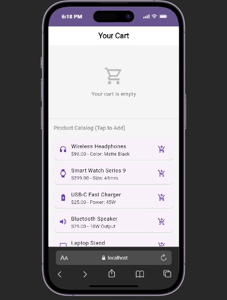

# AlertDialog Widget in Flutter

---

## Overview

This app shows how the **AlertDialog** widget works in a simple shopping cart system.

It shows how real apps, like food delivery apps like VubaVuba, ask users to confirm actions before adding or removing items.

The cart updates in real time, and the total price updates when items are added/removed.

---

## Real-World Use Case

This app uses AlertDialog in two main situations:

### 1. Add to Cart
When you tap a product, a dialog appears asking if you want to add the item to the cart.

### 2. Remove from Cart
When you tap the delete icon, a dialog appears asking if you want to remove the item.

Both use the same AlertDialog widget, but with different messages depending on the action.

---

## How to Run

1. Clone this repository  
2. Open a terminal in the project folder:
   ```
   cd AlertDialog-Widget
   ```

3. Get dependencies:

   ```
   flutter pub get
   ```

4. Run the app:

   ```
   flutter run
   ```

5. Try the app:

   * Tap a product, and its details appear
   * Tap add icon, and an add confirmation dialog appears 
   * Tap delete icon, and remove confirmation dialog appears

---

## Dependencies

This project uses Flutter’s default packages:

* flutter (SDK)
* cupertino_icons

No extra external packages were added.

---

## AlertDialog Properties Used

| Property    | What it does                               | Example (Add)          | Example (Remove)                      |
| ----------- | ------------------------------------------ | ---------------------- | ------------------------------------- |
| **title**   | Shows the heading at the top of the dialog | “Add this item?”       | “Remove this item?”                   |
| **content** | Shows the message inside the dialog        | “Add it to your cart?” | “Are you sure you want to remove it?” |
| **actions** | The buttons at the bottom of the dialog    | Cancel / Add           | Cancel / Remove                       |

---

## What you see on screen

* **title** - the main question at the top of the dialog
* **content** - explains what will happen before confirming
* **actions** - buttons that let the user cancel or continue

These help prevent users from making accidental actions.

---

## App UI



---

## [Demo Video](https://youtu.be/5cuxuvKClVw?si=VJa7HInrzbEP3oJv)

---

## Resources & Tools Used

### Flutter Documentation:
- [Flutter AlertDialog](https://api.flutter.dev/flutter/material/AlertDialog-class.html)
- [showDialog Function](https://api.flutter.dev/flutter/material/showDialog.html)
- [TextButton Widget](https://api.flutter.dev/flutter/material/TextButton-class.html)
- [ElevatedButton Widget](https://api.flutter.dev/flutter/material/ElevatedButton-class.html)

---

### Inspiration:
- Modern e-commerce apps such as Amazon and VubaVuba (for shopping cart confirmation flow and UI behavior)

---

### Tools:
- Flutter SDK (for building the application)
- Visual Studio Code (code editor)
- Git & GitHub (version control)
- Gemini AI (help format project documentation)


---

## License
This project is under the MIT License

---

## Author
Monica Dhieu

---

*Tuesday, June 9, 2026*
